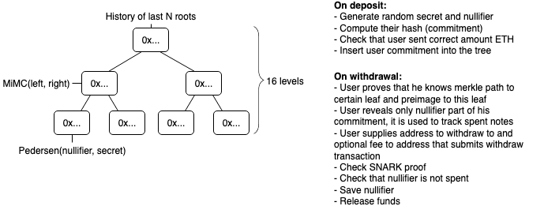

# Tornado mixer 

## Specs
- Deposit gas cost: deposit 888054
- Withdraw gas cost: 692133
- Circuit constraints: 22617
- Circuit proving time: 6116ms
- Serverless

## Security risks
* Cryptographic tools used by mixer (zkSNARKS, Pedersen commitment, MiMC hash) are not yet extensively audited by cryptographic experts and may be vulnerable
	* Note: we use MiMC hash only for merkle tree, so even if a preimage attack on MiMC is discovered, it will not allow to deanonymize users. To drain funds attacker needs to be able to generate arbitrary hash collisions, which is a pretty strong assumption.
* Relayer is frontrunnable. When relayer submits a transaction someone can see it in tx pool and frontrun it with higher gas price to get the fee and drain relayer funds.
	* Workaround: we can set high gas price so that (almost) all fee is used on gas. The relayer will not receive profit this way, but this approach is acceptable until we develop more sophisticated system that prevents frontrunning
* Bugs in contract. Even though we have an extensive experience in smart contract security audits, we can still make mistakes. An external audit is needed to reduce probablility of bugs
* ~~Nullifier griefing. when you submit a withdraw transaction you reveal the nullifier for your note. If someone manages to
make a deposit with the same nullifier and withdraw it while your transaction is still in tx pool, your note will be considered
spent since it has the same nullifier and it will prevent you from withdrawing your funds~~
  * Fixed by sending nullifier hash instead of plain nullifier

## Requirements
1. `node v11.15.0`
2. `npm install -g npx`

## Usage
1. `npm i`
1. `cp .env.example .env`
1. `npm run build:circuit` - may take 10 minutes or more
1. `npm run build:contract`
1. `npm run browserify`
1. `npx ganache-cli`
1. `npm run test` - optionally run tests. It may fail for the first time, just run one more time.
1. `npm run migrate:dev`
1. `./cli.js deposit`
1. `./cli.js withdraw <note from previous step> <destination eth address>`
1. `./cli.js balance <destination eth address>`
1. `vi .env` - add your Kovan private key to deploy contracts
1. `npm run migrate`
1. `npx http-server` - serve current dir, you can use any other http server
1. Open `localhost:8080`

## Credits

Special thanks to @barryWhiteHat and @kobigurk for valuable input,
and to @jbaylina for awesome [Circom](https://github.com/iden3/circom) & [Websnark](https://github.com/iden3/websnark) framework
